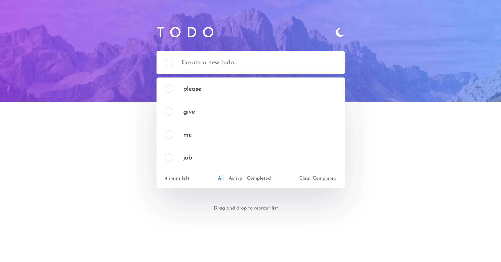

Todo App is a dynamic web application built with React, designed for managing tasks with features to add, complete, delete, and filter todos. It includes a theme toggle for light and dark modes, local storage for data persistence, and a responsive design optimized for mobile and desktop.

